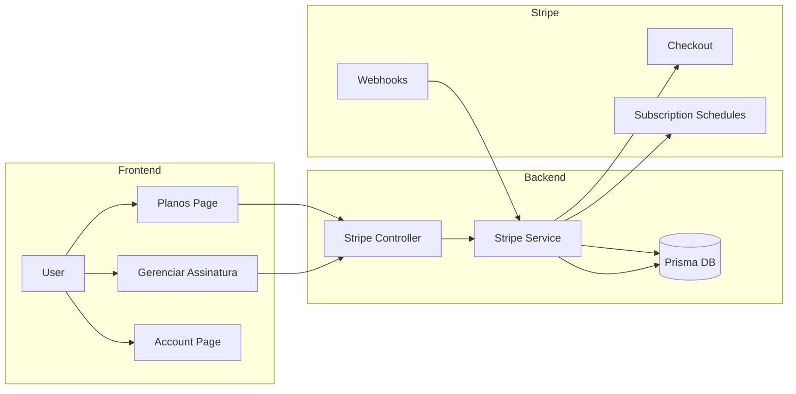
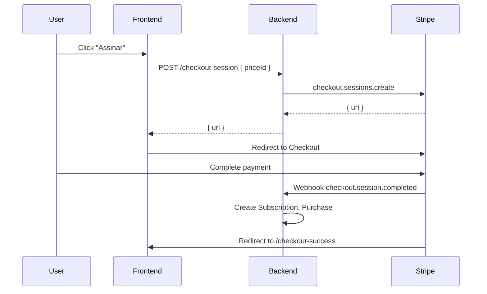
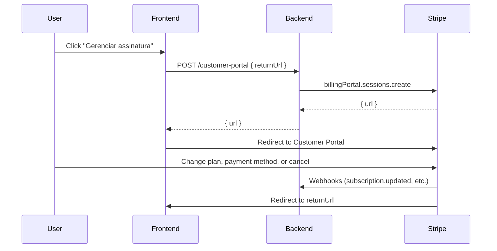
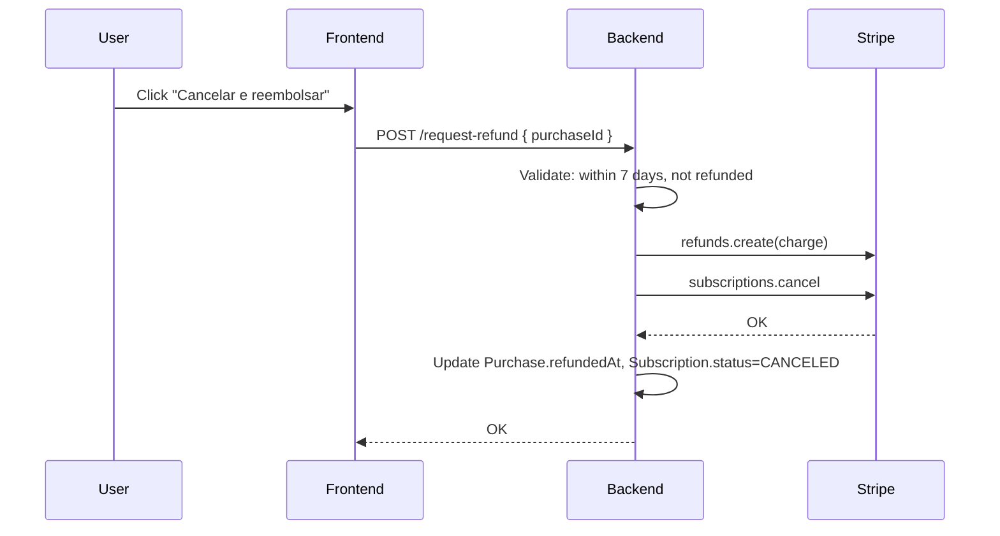

# Subscription System Documentation

This document describes the Itera subscription system: plans, states, transitions, and technical implementation. It is intended for developers and product stakeholders.

---

## 1. Overview

The subscription system integrates with **Stripe** for payment processing. Key concepts:

- **Models**: `User`, `Subscription`, `Purchase`
- **Stripe**: Products, Prices, Checkout, Customer Portal, Webhooks, Subscription Schedules
- **Plan hierarchy**: ESSENCIAL < ESTRATEGICO < ELITE

### Data flow



---

## 2. Plans and Benefits

| Plan | Exams | Explanations | History | Smart Trainings |
|------|-------|--------------|---------|-----------------|
| **Essencial** | Unlimited | Yes | Yes | 0/month |
| **Estratégico** | Unlimited | Yes | Yes | 5/month |
| **Elite** | Unlimited | Yes | Yes | 20/month |

### Billing

- **Monthly** or **Annual** (6 Stripe prices total: 3 plans × 2 intervals)
- Environment variables: `STRIPE_PRICE_ESSENCIAL_MONTHLY`, `STRIPE_PRICE_ESSENCIAL_YEARLY`, etc.

---

## 3. User States

| State | Description | Access |
|-------|-------------|--------|
| **inactive** | No active subscription | Can view exam/training lists. Cannot access specific exams, trainings, or history. |
| **active** | Active subscription, outside CDC period | Full access per plan. |
| **trial** | Within 7 days of first purchase (CDC withdrawal right) | Same as active. Can request full refund. |

### CDC (Código de Defesa do Consumidor)

Brazilian law grants a 7-day withdrawal right after purchase. During this period, the user can cancel and receive a full refund without justification.

---

## 4. Plan Change Flow (UI)

| From → To | Flow |
|-----------|------|
| Inactive → Any plan | Checkout (new subscription) |
| Active → Any change (upgrade, downgrade, interval) | **Stripe Customer Portal** |

**Usuários inativos**: Assinam via Checkout (redirecionamento ao Stripe).

**Usuários ativos**: Todas as alterações de plano (upgrade, downgrade, troca mensal↔anual) são feitas pelo **Stripe Customer Portal**. O usuário clica em "Gerenciar assinatura" e é redirecionado ao portal seguro do Stripe, onde pode alterar plano, forma de cobrança, método de pagamento e cancelar.

---

## 5. Special Cases

### CDC refund (7 days)

- Cancels the Stripe subscription.
- Creates a refund for the charge.
- User returns to `inactive`.

---

## 6. Endpoints

| Method | Endpoint | Description |
|--------|----------|-------------|
| GET | `/stripe/plans` | List plans with prices and features |
| POST | `/stripe/checkout-session` | Create Checkout session for new subscription |
| POST | `/stripe/customer-portal` | Create Customer Portal session (plan change, payment method, cancel) |
| GET | `/stripe/access` | User access state (plan, status, limits, scheduled change) |
| POST | `/stripe/request-refund` | Request CDC refund |

---

## 7. Webhooks

| Event | Handler | Action |
|-------|---------|--------|
| `checkout.session.completed` | `handleCheckoutCompleted` | Create Subscription, link to User |
| `customer.subscription.updated` | `handleSubscriptionUpdated` | Sync plan, status, period. Clear scheduled fields when phase changes. |
| `customer.subscription.deleted` | `handleSubscriptionDeleted` | Mark Subscription as CANCELED |
| `invoice.payment_succeeded` | `handleInvoicePaymentSucceeded` | Create Purchase record |
| `invoice.payment_failed` | `handleInvoicePaymentFailed` | Mark Subscription as PAST_DUE |
| `charge.refunded` | `handleChargeRefunded` | Set Purchase.refundedAt |

---

## 8. Flows

### New subscription



### Plan change (Customer Portal)



### CDC refund



---

## 9. Environment Variables

```env
STRIPE_SECRET_KEY="sk_..."
STRIPE_WEBHOOK_SECRET="whsec_..."
FRONTEND_URL="http://localhost:3001"

STRIPE_PRICE_ESSENCIAL_MONTHLY="price_..."
STRIPE_PRICE_ESSENCIAL_YEARLY="price_..."
STRIPE_PRICE_ESTRATEGICO_MONTHLY="price_..."
STRIPE_PRICE_ESTRATEGICO_YEARLY="price_..."
STRIPE_PRICE_ELITE_MONTHLY="price_..."
STRIPE_PRICE_ELITE_YEARLY="price_..."
```

---

## 10. Database Schema (Subscription)

| Field | Type | Description |
|-------|------|-------------|
| id | UUID | Primary key |
| userId | UUID | Owner |
| stripeSubscriptionId | String | Stripe sub_xxx |
| stripeCustomerId | String | Stripe cus_xxx |
| stripePriceId | String | Current price (price_xxx) |
| plan | SubscriptionPlan | Current plan |
| status | SubscriptionStatus | ACTIVE, PAST_DUE, CANCELED, INCOMPLETE |
| currentPeriodStart | DateTime | Billing period start |
| currentPeriodEnd | DateTime | Billing period end |
| cancelAtPeriodEnd | Boolean | Will cancel at period end |
| stripeScheduleId | String? | Schedule ID when downgrade is scheduled |
| scheduledPlan | SubscriptionPlan? | Plan that will take effect next period |
| scheduledPriceId | String? | Price that will take effect next period |
